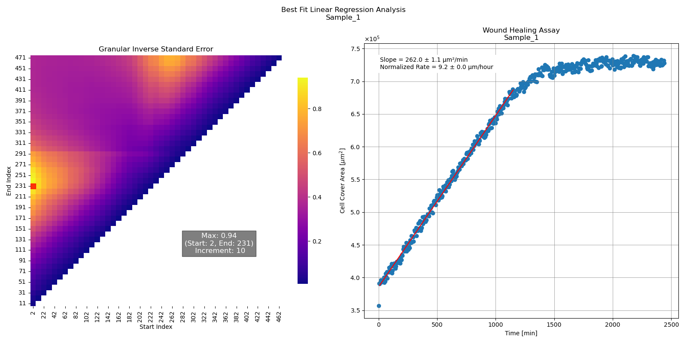

# Granular Linear Regression Analysis Tool



## Description
This repository contains a Python script for finding the best linear regression fit domain of experimental 
(i.e. noisy) data samples by coarse graining fit ranges to granular increments and finding the lowest standard 
error (highest inverse standard error). This is useful for calculating rates (e.g. cell front velocity, proliferation rate, etc.)
from measurements that also include multiple linear or non-linear behaviors. 

Parameters and data links are defined in `config.py`. 
A test dataset is included in `\tests\`.


## Table of Contents
- [Installation](#installation)
- [Setup](#setup)
- [Usage](#usage)
- [Contributing](#contributing)
- [License](#license)
- [Acknowledgements](#acknowledgments)
- [Notes](#notes)

## Installation
Instructions on how to install the project assuming Anaconda is installed:

### Clone the repository from GitHub
```bash
git clone https://github.com/carytutmarc/granular-linear-regression-tool.git
```

### Create a new conda environment from environment.yml

Deactivate the current environment and create a new project-specific one (default: granular-lra):

```python
conda deactivate
conda env create -f environment.yml
```
Optionally, the environment can be renamed using:
```python
conda env create -n <ENVNAME> -f environment.yml
```
Activate the environment in the Anaconda prompt if working in terminal:
```python
conda activate <ENVNAME>
```
The project can also be opened in VS Code as a Workspace.

## Setup
The script currently requires input data in a form compatible with pandas dataframes. Required variables are X, Y, and Sample_Name, although the column names can be freely chosen. See the `\tests\testdata.csv` for an example. The user must define the data parameters in `config.py`.

1. Set the granularity variables:
```python
# config.py
class GridObj:
    def __init__(self):
        self.START = 2   # Index of data point to start fit grid
        self.STARTMAX = None # Set the highest starting index to test
        self.INCREMENT = 10   # Increment i.e. grid size of fit steps
        self.LENGTHMIN = 4 * self.INCREMENT # Miniumn length of linear fit
        self.LENGTHMAX = None # Maximum allowed fit length
        self.ENDMAX = None    # Optional 0.0-1.0 value to lower max fit length

```
2. Import user data into pandas dataframe df by defining file type and path:
```python
# config.py
class PlotConfig:
    def load_dataframe(self):
        # Load desired dataset into pandas dataframe 
        # Requires X (list), Y (list), and Sample (string) data
        df = pd.read_
```
3. Set plot and data parameters:
```python
        # Configure dataset parameters
        self.sample = 'Title' # Column where sample names are found
        self.xVar = 'Time_Minutes' # Column where X data is found
        self.yVar = 'Cover_Area' # Column where Y data is found
        self.x_label = 'Time [min]'
        self.y_label = r'Cell Cover Area [$\mu m^2$]'
        self.title = 'Wound Healing Assay' # Linear fit graph title
        self.slopeunits = 'µm²/min'
```
4. Choose normalization or set `self.normalization = 1`:
```python
        # Normalization factor
        self.normalization = (df['Stage_Height_Micron'] / 60) * 2 # Normalization to be applied to slope
        self.ratelabel = 'Normalized Rate' #Annotation label for the rate value e.g. Proliferation Rate
        self.normalunits = 'µm/hour' #Normalized units applying normalization in HeatmapConfig
        
        return df
```
5. Select the dataframe to analyze in `main.py` by uncommenting `df = config.load_dataframe()`. The test dataset is on by default.
```python
# main.py
# Load the test dataset as defined in config.py
config = PlotConfig()
df = config.load_test_dataframe()

# Load dataset from config.py
#df = config.load_dataframe()
```
6. Run the script. Figures are saved to the `\visualization\` folder and output data is saved to `\data\granular_linear_regression_results.csv`.

## Usage
<p align="center">
    
</p>

This tool offers a convenient method for calculating rates from XY data, particularly when there are distinct linear regions of interest, alongside noise and non-linear behavior. For instance, the image above depicts raw data from a 2D cell wound healing (gap closure) assay, where the independent variable (X) represents time (with one frame captured every 5 minutes), and the dependent variable (Y) indicates the total area (in µm²) covered by cells at each time point.

**Example Use Case**: Identifying the optimal time domain for estimating the linear regression fit of a 2D cell wound healing (gap closure) assay's changes in covered surface area to calculate the cell front velocity. This process involves capturing microscopy images at regular time intervals, determining the stage area covered by cells at each interval, and subsequently calculating the linear slope of the area versus time curve to derive the rate of area change. This rate is then normalized by the microscopy stage dimensions to ascertain the cell front velocity, which can be compared across samples. Two challenges arise in the sample shown above, which this tool aims to address.

First, during the initial minutes of a microscopy measurement, the sample may go out of focus due to thermal drift, holder shift, user adjustments, etc. Such issues can lead to a sudden change in the measured cell coverage area, as observed between the first and second points in the figure above. By configuring the `START` value in `config.py`, users can skip the initial data points collected before the measurement system stabilizes. This value is applied throughout the entire dataset, ensuring that all samples undergo the same equilibration period.

<p align="center">
    
</p>

The second issue that arises in such an experiment is the transition from linear area growth to a saturation of the covered area, resulting in a plateau in the data when the gap is closed. These two regions are clearly illustrated above, where the heatmap shows two optimal linear regression fit ranges, and the graph depicts a steady linear increase followed by a flattened region. By adjusting `STARTMAX`, `LENGTHMAX`, and `ENDMAX` in `config.py`, the second region can be excluded if it interferes with fitting the first region.

## Contributing

Contributions are welcome! Please read [CONTRIBUTING.md](CONTRIBUTING.md) for details on the process for submitting pull requests.

## License

This project is licensed under the MIT License - see the [LICENSE](LICENSE) file for details.

## Acknowledgments

- The inspiration for this tool came from comments by Jon Spring on Stack Overflow:
https://stackoverflow.com/questions/68960656/how-to-only-fit-the-linear-portion-of-a-dataset

## Notes
Check my posts in the Issues section for features I want to add and bugs I have found.

Project Link: [GitHub Repository - Granular Linear Regression Analysis Tool](https://github.com/carytutmarc/granular-linear-regression-tool)